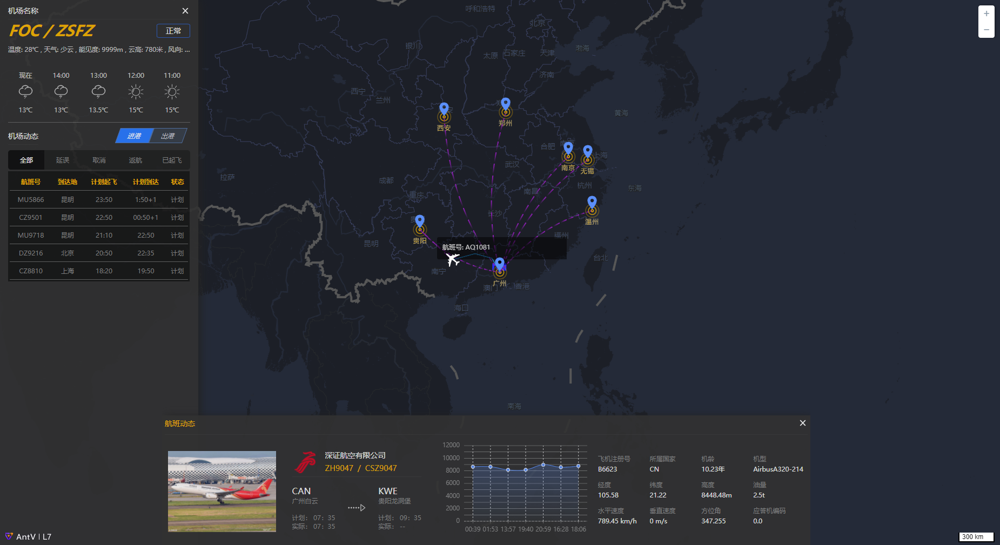

# ## 项目简介

仿`variflight`的航班追踪界面


## ## 启动项目

Install dependencies,

```bash
$ yarn
```

Start the dev server,

```bash
$ yarn start
```

/map :  antv L7 实现, L7不支持获取贝塞尔曲线的坐标点, 暂时无法在飞线上添加图标
/mapbox: mapbox.gl 实现, mapbox.gl 需要配合turf计算贝塞尔曲线, 但是计算出来的曲线不曲


## 界面截图

